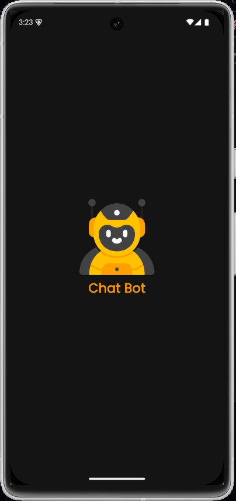
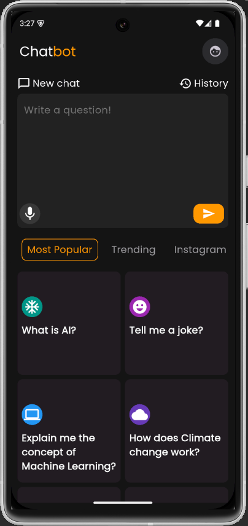
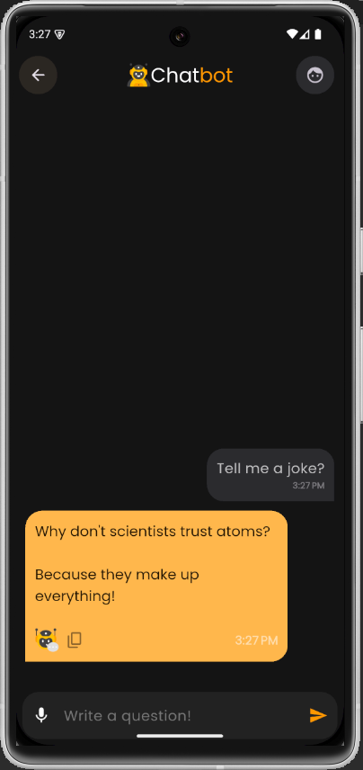
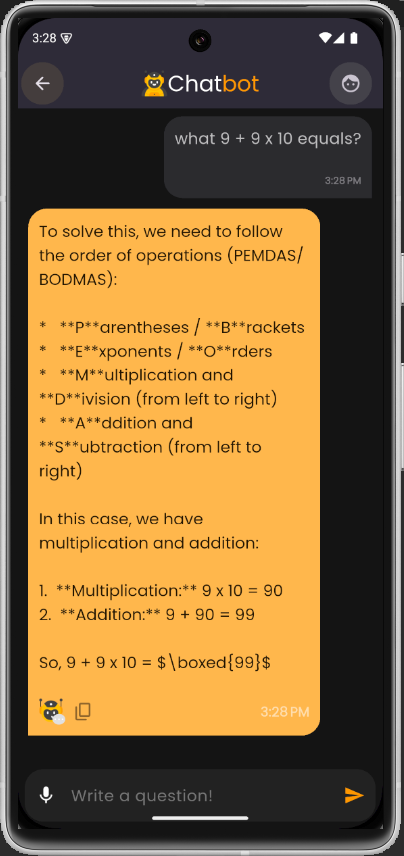

# Chat Bot App

Aplikasi **Chat Bot App** adalah aplikasi interaktif yang memungkinkan pengguna berkomunikasi dengan bot secara real-time.  
Dibuat untuk memberikan pengalaman percakapan otomatis yang dapat membantu dalam berbagai use case seperti **customer support, edukasi, maupun hiburan**.

---

## ✨ Fitur Utama

- 💬 Chat interaktif dengan bot
- 📱 Antarmuka sederhana dan responsif
- ⚡ Respons cepat
- 🗂 Dokumentasi tampilan aplikasi tersedia di folder `documentation-app`

---

## 🛠 Teknologi yang Digunakan

- **Flutter** untuk pengembangan aplikasi mobile (Android/iOS)
- **Dart** sebagai bahasa utama
- **State Management** (misalnya Provider/Bloc — sesuaikan dengan project kamu)
- **API/AI Engine** untuk mengelola respons chatbot

---

## 🚀 Instalasi & Menjalankan

1. Clone repository:

   ```bash
   git clone https://github.com/username/chat_bot_app.git
   cd chat_bot_app

   ```

2. Install dependencies:

   ```bash
   flutter pub get

   ```

3. Jalankan aplikasi:
   ```bash
   flutter run
   ```

## 📸 Dokumentasi Tampilan Aplikasi

Semua dokumentasi tampilan ada di folder documentation-app
Berikut beberapa cuplikan tampilan:
| Splash screen | Dashboard | Chat with template | Chat with AI |
|-----------|------------|----------------------|------------------|
|  |  |  |  |

## This app uses Google Gemini API for AI responses. Ensure you have a valid API key:

# Get your API key from Google Cloud Console

# Add it in your lib/data/urls.dart:

class Urls {
static const String geminiBaseUrl =
"YOUR_GEMINI_BASE_URL";
static const String ApiKey = "YOUR_API_KEY";
}
